  

 

  <h3>I am an Electronics & Communication Engineering undergraduate deeply focused on Computer Science—building intelligent systems, scalable cloud applications, and exploring the frontiers of AI. I enjoy turning complex ideas into working, real-world software.</h3>

---

 

### 🚀 What I'm Exploring

<table align="center" width="100%">
  <tr>
    <td width="50%">
      <b>🏗️ Building</b> 
      Tactical signal analysis & intelligence platforms (SpectraSense)
    </td>
    <td width="50%">
      <b>🧠 Learning</b> 
      Advanced Machine Learning, Cloud Architecture & DevOps
    </td>
  </tr>
  <tr>
    <td width="50%">
      <b>💡 Exploring</b> 
      AI / ML, Full-Stack Development, Intelligent Systems
    </td>
    <td width="50%">
      <b>🔧 Improving</b> 
      Software Engineering, System Design, Problem Solving
    </td>
  </tr>
</table>

 

### 🛠️ Tech Stack

**Languages** 

**AI / Machine Learning** 

**Development** 

**Cloud & DevOps** 

 

### 🏆 Achievements

- 🥇 **1st Prize, Track 04 — QTHack04'26** | *Sampling & Aliasing Visual Demonstrator*
- 👔 **Secretary — IETE Club** | *Leading technical initiatives and community engagement*

 

### 📌 Featured Projects

<table width="100%">
  <tr>
    <td width="50%" valign="top">
      <b><a href="https://github.com/ayushman006/SpectraSense">SpectraSense</a></b> 📡 
      Signal intelligence and analysis platform combining Python, FastAPI, DSP, and Machine Learning. 
      <i><a href="https://spectrasense.onrender.com/">Live Demo</a></i>
    </td>
    <td width="50%" valign="top">
      <b><a href="https://github.com/ayushman006/ECDAT---Crypto-Discovery-Tool">ECDAT Crypto Discovery Tool</a></b> 🔐 
      Cryptographic discovery and risk assessment tool focusing on security assets and post-quantum exposure.
    </td>
  </tr>
  <tr>
    <td width="50%" valign="top">
      <b><a href="https://github.com/ayushman006/digital-doppelganger">Digital Doppelganger</a></b> 🧠 
      AI-powered digital interaction and intelligence system.
    </td>
    <td width="50%" valign="top">
      <b><a href="https://github.com/ayushman006/doppel-backend">Doppel Backend</a></b> ⚙️ 
      Backend services and APIs supporting the Digital Doppelganger ecosystem.
    </td>
  </tr>
  <tr>
    <td width="50%" valign="top">
      <b><a href="https://github.com/ayushman006/Sampling-Aliasing-Visualizer">Sampling & Aliasing Visualizer</a></b> 📈 
      Interactive visual demonstrator for sampling, aliasing, and signal reconstruction.
    </td>
    <td width="50%" valign="top">
      <b><a href="https://github.com/ayushman006/Weather-Prediction-ML">Weather Prediction ML</a></b> 🌦️ 
      Predictive modeling leveraging machine learning for weather forecasting.
    </td>
  </tr>
</table>

 

### 📊 GitHub Stats

  
  

 

### 📫 Let's Connect

  
  
  

